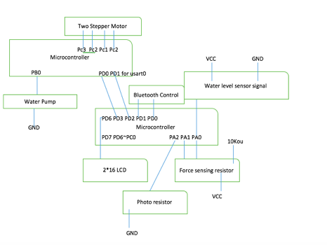

# Pet-Feeding-Machine

## Qiwen Lyu
Control Panel, Bluetooth, Water level sensor,Water Pump

## Leng Zhang
Control sensing system, Photoresistor,Drawer,Force Sensing Resistor

## High Level Description of Project
This is a pet feeding machine. There are three different parts in the system: control panel system, control sensing system alongside with the control system. Control panel system is for user to control the system. Control sensing system can sense ADC values from sensors and make decision accordingly. Control system will simply finish the task according the signal from control sensing system.

## User Guide
After turn on the system, the user can see the menu on the Nokia LCD screen. There are four choices. Manual can enable the pet feeding drawer to go out.  Schedule have three time choies. User can turn one of the time on by pressing button C on the keypad. Set time will set the whole system’s time. Dossage can tell the user how much food the pet eat. It will get the drawer back after it reach the value that user set. The water pump part is another system. It will add the water automatic into the bowl until it hit the adc value = 780.

## Technologies and components:
Nokia 5100 48x84 LCD,2x16 LCD,Water Level Sensor,Force Sensing Resistor,Photoresistor

Water Pump,Stepper Motor,Bluetooth,Keypad,Usart,AVR Studio 6, ATmega1284

## Link to Project Demo Video
[https://youtu.be/xsBDaPKjLy8](https://youtu.be/xsBDaPKjLy8)

## Link to Each Source File and Summary
This is the file for pet feeding control sensing system which check the adc value as well as the weight. It will send out signal to the control system according to the adc value as well as the bluetooth signal from the control panel.
[https://drive.google.com/file/d/0Bz8fbxdzC3PXQ25XYUJLTVpGcDg/view?usp=sharing](https://drive.google.com/file/d/0Bz8fbxdzC3PXQ25XYUJLTVpGcDg/view?usp=sharing)

This file is for the control part, after it get the certain value, it will send out the signal to the water pump or the two stepper motors for the drawer. 
[https://drive.google.com/file/d/0Bz8fbxdzC3PXNW92bWROMXRwaUU/view?usp=sharing](https://drive.google.com/file/d/0Bz8fbxdzC3PXNW92bWROMXRwaUU/view?usp=sharing)

This file is for the control panel system. It have a screen to show all the setting of the machine. All the details are inside the user guide. 
[https://drive.google.com/file/d/0Bz8fbxdzC3PXSUNEVW5zZjB6Zjg/view?usp=sharing](https://drive.google.com/file/d/0Bz8fbxdzC3PXSUNEVW5zZjB6Zjg/view?usp=sharing)

## Drawings explaining how components are connected to microcontroller:

### Feeding Machine

### Control Panel
